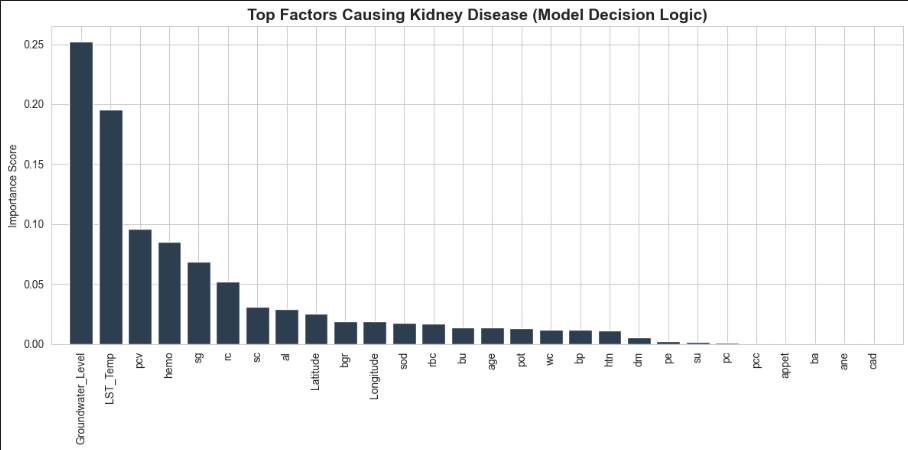
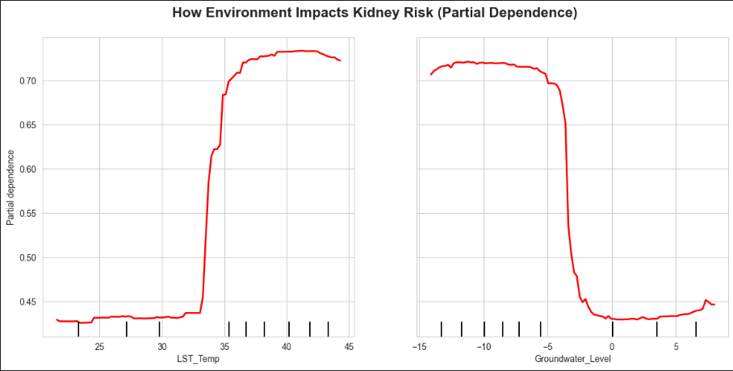
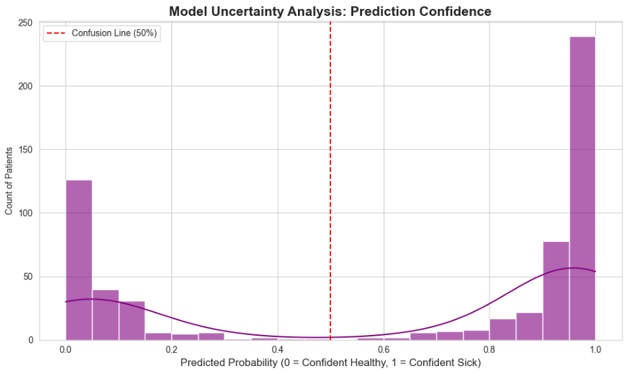
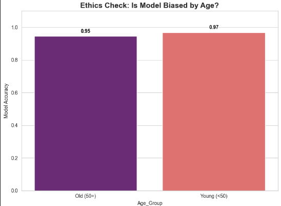

# 🌍 Framework for Investigating Environmental Triggers in CKDu (Chronic Kidney Disease)

## 📌 Abstract
**Chronic Kidney Disease of Unknown etiology (CKDu)** is a major epidemiological crisis, strongly hypothesized to be linked to **Groundwater Depletion** and the subsequent **Geogenic Leaching** of nephrotoxic heavy metals like **Arsenic (As)** and **Cadmium (Cd)**.

This project presents a **privacy-preserving simulation framework** to analyze these environmental triggers using **Explainable AI (XAI)** and **Uncertainty Quantification**, ensuring the model is trustworthy and fair before real-world deployment.

---

## 🏗️ System Architecture (The Pipeline)

> **Note:** Since real-world patient location data is restricted due to privacy laws (HIPAA/GDPR), this framework utilizes a **Synthetic Data Environment** generated based on hydro-geochemical research patterns (e.g., correlating low water tables with high metal concentration).

### The Workflow:
`[KCDu Data + Synthetic Environment (Satellite Data)]` ➔ `Random Forest Classifier` ➔ `XAI Analysis (Feature Importance/PDP)` ➔ `Fairness Check` ➔ `Risk Output`

---

## 🧠 Explainable AI (XAI) Analysis

To avoid the "Black Box" problem in healthcare, I employed **Global Interpretability** methods to validate the hydro-geological hypothesis.

### 1️⃣ Identifying the Root Cause (Global Feature Importance)
The model ranks environmental features based on their impact. The simulation correctly identifies **Groundwater Level** as the primary driver of disease risk, aligning with toxicological studies.

*(Fig 1: Ranking of features. Groundwater Level is identified as the most critical factor.)*

### 2️⃣ Understanding the Behavior (Partial Dependence Plot)
**Hypothesis Validation:** Does lower water increase risk?
The PDP below confirms the **negative correlation**: As the groundwater level drops (x-axis), the probability of CKDu (y-axis) increases, simulating the concentration of heavy metals.

*(Fig 2: Partial Dependence Plot showing the impact of Groundwater depletion on risk probability.)*

---

## 🛡️ Safety & Ethics Layer

A medical model must be safe and unbiased.

### 3️⃣ Uncertainty Quantification (Confidence Scoring)
A prediction is dangerous if the model is "confusingly confident." I implemented **Probability Estimation** to flag uncertain cases where the model's confidence is low, suggesting a need for human doctor intervention.

*(Fig 3: Histogram of Prediction Probabilities showing the model's certainty levels.)*

### 4️⃣ Ethical Fairness Check (Bias Detection)
I analyzed the model's performance across different demographics (Young vs. Old) to ensure that the algorithm does not discriminate based on age, a critical requirement for clinical AI deployment.

*(Fig 4: Fairness audit ensuring equal error rates across age groups.)*

---

## 🚀 Conclusion & Future Scope
This simulation serves as a **"Proof of Concept" (POC)**. The framework demonstrates a robust pipeline that is:
1.  **Transparent** (via XAI)
2.  **Safe** (via Uncertainty Quantification)
3.  **Ethical** (via Fairness Constraints)

**Future Goal:** To fuse this framework with **Real Satellite Imagery (Sentinel/GRACE)** and **Hospital Data** 

---
*Developed by [Sourabh]*
*Research Interest: AI in Earth Observation & Healthcare*
